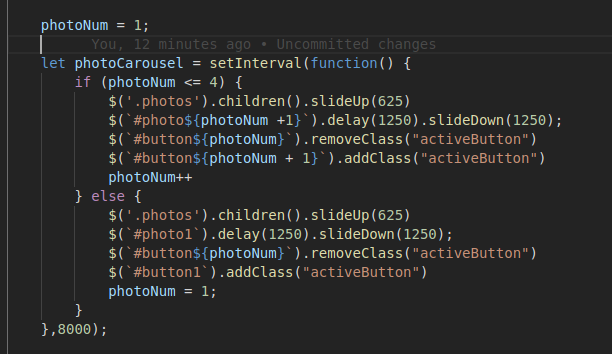

# project0

Website created for the WDI 51 Class by Matthew Freeland.

#Technology Stack:
Built using HTML, CSS, and Vanilla Javascript with JQuery 3.1.1.

#Process:
The highlevel approach to this project was to frame out the HTML first and foremost. 
I knew that I needed to break into 4 general sections with a header and footer.
I laid out the HTML semantically and then set my css all to margin0 with black borders
to better visualize the areas. After adding some container divs for my main functions
like the photo carousel and testimonials carousel, I went to work styling the page.

Once styling was completed, I moved into the Javascript functions. The functions include: a responsive click-nav in the header, a scrolling photo carousel, a rotating
quotes carousel, and a fullscreen function for images. I framed out a lot of the basic
concepts for the carousels with the intent to build them from DOM manipulation rather
than pre-coding them as HTML, but, since scalability wasn't really a factor to worry
about, I opted instead to precode them to make styling and delivery easier.

#Existing Problems:
There are a few lingering problems with the website. 
    1 - If you scale down to responsive smaller screen and click the hamburger menu the
    nav or header will be removed permanently and need to be refreshed. This can likely
    be resolved by changing the display/hide method to use classes instead of toggle.

    2 - The contact form doesn't actually submit any emails. I haven't taken apart
    the form to find out how to complete it.

    3 - If you click on one of the image radio buttons on the photo carousel while the
    image is transitioning, it will load 2 images and quickly resolve it, but, it looks really dumb.

    4 - the code for the photo carousel is extremely messy and repetitive, it needs to be rebuilt with object arrays instead of referencing static item IDs.

#Triumphs:
I made the photo carousels and testimonials work. That was extremely difficult especially opting to eschew bootstrap. The framing part of the website went extremely smoothly for me, taking up only a tiny part of the development cycle, learning lessons from the storefront homework helped me better prepare myself for the process of building a site from scratch.

I am particularly proud of the photo carousel, it was a challenge to get it to function correctly, but, with some pretty light code it works.
